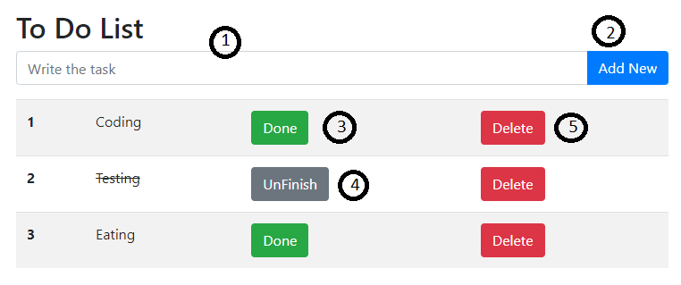

# Js To-Do-List

- [Js To-Do-List](#js-to-do-list)
  - [Text Input Field](#text-input-field)
  - [Add New Button](#add-new-button)
  - [Done Button](#done-button)
  - [Unfinish Button](#unfinish-button)
  - [Delete Button](#delete-button)

## Text Input Field

This is the text field to fill your task.

## Add New Button

The button is to add new task and store to localstorage.

## Done Button

This button is the task done.

## Unfinish Button

This button is the task unfinish.

## Delete Button

This button is to delete the task.
